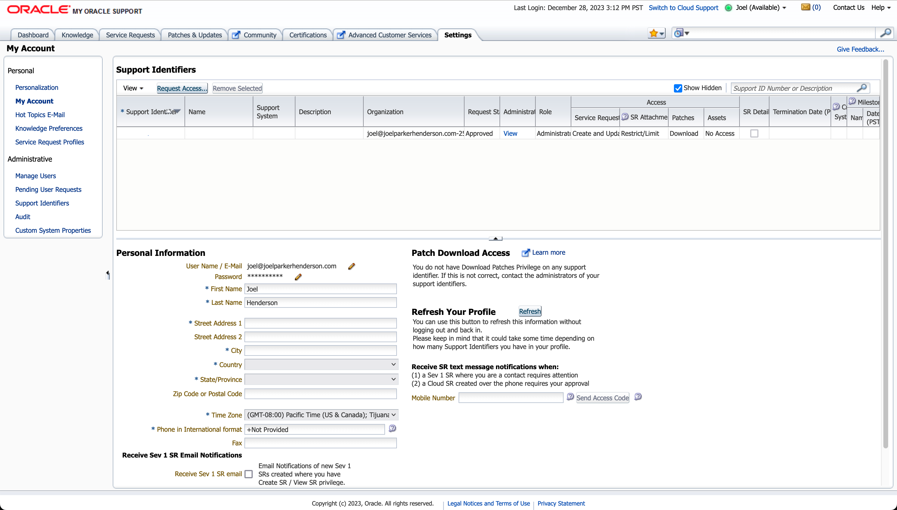

# Demo Oracle APEX 

Demonstration of:

* [Oracle APEX enterprise low-code application platform](https://apex.oracle.com/)

* [Oracle Linux](https://www.oracle.com/linux/)

* [Oracle Database](https://www.oracle.com/database/)

* [Oracle Cloud Infrastructure](https://www.oracle.com/cloud/)

* [Oracle Support](https://support.oracle.com/)

* [Oracle VM VirtualBox](https://www.virtualbox.org/)


## Purpose

The purpose of this repository is to demonstrate the Oracle technology stack for low-code application programming. 

This repository is free open source. 

Feedback welcome. Issues welcome. Merges welcome.


## Glossary

Oracle APEX: Abbreviation of "Oracle Appication Experience".

AArch64: The official name for Arm's 64-bit instruction set architecture. A.k.a. arm64.

dnf: Abbreviation of "Dandified YUM"; dnf is an improved version of the YUM package manager.

OVA: Open Virtual Appliance.

QEMU: An open source machine emulator and virtualizer.

VM: virtual machine


## Options

There are options for how to get Oracle APEX ready.

Options for emulation/virtualization:

* [Oracle VM VirtualBox](doc/oracle-vm-virtualbox)
  
* [UTM QEMU](doc/utm-qemu)

Options for Oracle Linux using emulation/virtualization:

* [Oracle Linux DVD ISO](doc/oracle-linux-dvd-iso)

* [Oracle Linux DVD ISO + macOS UTM QEMU emulator](doc/oracle-linux-dvd-iso-and-macos-utm-qemu-emulator)

* [Oracle Linux DVD ISO + Oracle VM VirtualBox](doc/oracle-linux-dvd-iso-and-oracle-vm-virtualbox)

* [Oracle Database 23c Free Developer Appliance + Oracle VM VirtualBox](doc/oracle-datbase-23c-free-developer-appliance-and-oracle-vm-virtualbox)

Options for getting Oracle Database:

* Once you have Oracle Linux running, then you can use the operating system package manager `dnf` to install Oracle Database 23c Free.


## Launch Oracle via container

To get Oracle containers:

1. Go to Oracle Container Registry:<br>https://container-registry.oracle.com/

2. Click the icon "Database". Look for the link that says "[free](https://container-registry.oracle.com/ords/f?p=113:4:114670892109671:::4:P4_REPOSITORY,AI_REPOSITORY,AI_REPOSITORY_NAME,P4_REPOSITORY_NAME,P4_EULA_ID,P4_BUSINESS_AREA_ID:1863,1863,Oracle%20Database%20Free,Oracle%20Database%20Free,1,0&cs=3tASddKV6PHe_DB5sOqUmUWkFKKS3JDuR_aY0fC10pjeYUgvx7fc1A9Zueh01JSgD68Ngk145m1fJWUpzNWFnBg
)"

3. Download and launch.


## Create Oracle Linux VM via VirtualBox

For prebuilt Oracle Database App Development VM:

1. Go to "Oracle Database 23c Free VirtualBox Appliance":<br>https://www.oracle.com/database/technologies/databaseappdev-vm.html

2. Look for the link "[Oracle DB Developer VM](https://download.oracle.com/otn_software/virtualbox/dd/Oracle_Database_23c_Free_Developer_Appliance.ova)"

3. Download and install.


## Generate Oracle Linux for VirtualBox

TODO


## Get Oracle Database

To install via dnf:
 	
```sh
dnf install -y oracle-database-free*
/etc/init.d/oracle-free-23c configure
```


## Get Oracle APEX

TODO


## Get Oracle Cloud

Sign up with Oracle Cloud:<br>
https://signup.cloud.oracle.com/

The sign up provides a free trial and also some always-free resources.

The sign up process requires a credit card.

The sign up offers multi-factor authentication such as via the Oracle Mobile App or FIDO.

After sign up, Oracle should send you a confirmation email such as "You have been associated to a cloud subscription."

Oracle Cloud should look something like this:


## Get Oracle Support

Sign up with Oracle Support:<br>
https://support.oracle.com/

After you sign up, Oracle should send you a confirmation email such as "You have been granted access to a Support Identifier for Oracle Support."

Oracle Support should show a "Settings" tab something like this:


