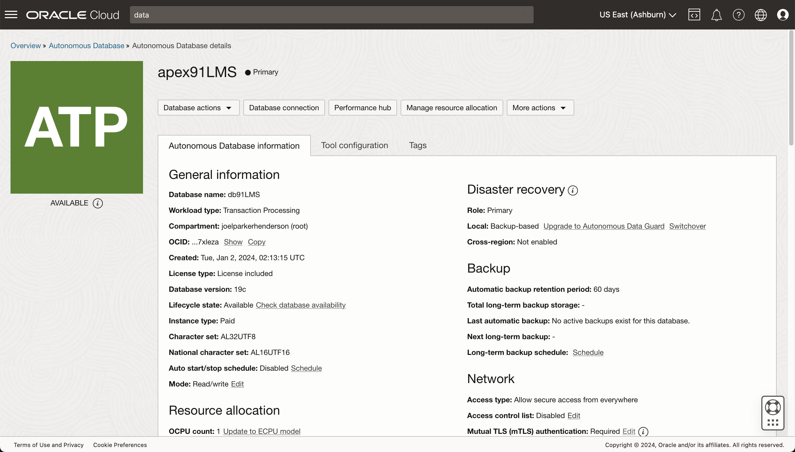

# Demo Oracle APEX 

Demonstration of:

* [Oracle APEX enterprise low-code application platform](https://apex.oracle.com/)

* [Oracle Linux](https://www.oracle.com/linux/)

* [Oracle Database](https://www.oracle.com/database/)

* [Oracle Cloud Infrastructure](https://www.oracle.com/cloud/)

* [Oracle Support](https://support.oracle.com/)

* [Oracle VM VirtualBox](https://www.virtualbox.org/)


## Purpose

The purpose of this repository is to demonstrate the Oracle APEX technology stack for low-code application programming. APEX comes bundled with services such as APEX Application Development (APEX Service) and Oracle Autonomous Database Serverless (ADBS).

This repository is free open source. 

Feedback welcome. Issues welcome. Merges welcome.


## Glossary

Oracle APEX: Abbreviation of "Oracle Application Experience".

AArch64: The official name for Arm's 64-bit instruction set architecture. A.k.a. arm64.

dnf: Abbreviation of "Dandified YUM"; dnf is an improved version of the YUM package manager.

OCI: Oracle Cloud Infrastructure.

OCID: Oracle Cloud Identifier.

OVA: Open Virtual Appliance.

QEMU: An open source machine emulator and virtualizer.

VCN: Virtual Cloud Network

VM: virtual machine


## Introductions

Introductions to APEX:

* [Get Started with Oracle APEX in Oracle Cloud Infrastructure](https://blogs.oracle.com/apex/post/get-started-with-oracle-apex-in-oracle-cloud-infrastructure)

* [Deploy a low-code app on Autonomous Database using APEX](https://cloud.oracle.com/resourcemanager/quickstarts?solution-name=apex)

Introductions to related topics:

* [Get Started with Autonomous Database](https://blogs.oracle.com/database/post/welcome-to-autonomous-database)


* [Oracle LiveLabs](https://apexapps.oracle.com/pls/apex/r/dbpm/livelabs/home)
  

## Options

There are options for how to get Oracle APEX ready.

Options for using Oracle Cloud: 

* [Free APEX Workspace](https://apex.oracle.com/en/learn/getting-started/)

Options for emulation/virtualization:

* [Oracle VM VirtualBox](doc/oracle-vm-virtualbox)
  
* [UTM QEMU](doc/utm-qemu)

Options for Oracle Linux using emulation/virtualization:

* [Oracle Linux DVD ISO](doc/oracle-linux-dvd-iso)

* [Oracle Linux DVD ISO + macOS UTM QEMU emulator](doc/oracle-linux-dvd-iso-and-macos-utm-qemu-emulator)

* [Oracle Linux DVD ISO + Oracle VM VirtualBox](doc/oracle-linux-dvd-iso-and-oracle-vm-virtualbox)

* [Oracle Database 23c Free Developer Appliance + Oracle VM VirtualBox](doc/oracle-datbase-23c-free-developer-appliance-and-oracle-vm-virtualbox)

Options for getting Oracle Database:

* Once you have Oracle Linux running, then you can use the operating system package manager `dnf` to install Oracle Database 23c Free.


## Launch Oracle via container

To get Oracle containers:

1. Go to Oracle Container Registry:<br>https://container-registry.oracle.com/

2. Click the icon "Database". Look for the link that says "[free](https://container-registry.oracle.com/ords/f?p=113:4:114670892109671:::4:P4_REPOSITORY,AI_REPOSITORY,AI_REPOSITORY_NAME,P4_REPOSITORY_NAME,P4_EULA_ID,P4_BUSINESS_AREA_ID:1863,1863,Oracle%20Database%20Free,Oracle%20Database%20Free,1,0&cs=3tASddKV6PHe_DB5sOqUmUWkFKKS3JDuR_aY0fC10pjeYUgvx7fc1A9Zueh01JSgD68Ngk145m1fJWUpzNWFnBg
)".

3. Download and launch.


## Get Oracle Database

To install via dnf:
 	
```sh
dnf install -y oracle-database-free*
/etc/init.d/oracle-free-23c configure
```

## Get Oracle Cloud

Sign up with Oracle Cloud:<br>
https://signup.cloud.oracle.com/

The sign up provides a free trial and also some always-free resources.

The sign up process requires a credit card.

The sign up offers multi-factor authentication such as via the Oracle Mobile App or FIDO.

After sign up, Oracle should send you a confirmation email such as "You have been associated to a cloud subscription."

Oracle Cloud should look something like this:


## Get Oracle Support

Sign up with Oracle Support:<br>
https://support.oracle.com/

After you sign up, Oracle should send you a confirmation email such as "You have been granted access to a Support Identifier for Oracle Support."

Oracle Support should show a "Settings" tab something like this:


## Deploy a low-code app on Autonomous Database using APEX

[Link](https://cloud.oracle.com/resourcemanager/quickstarts?solution-name=apex)

Select your compartment. 

* We use: "joelparkerhenderson (root) / ManagedCompartment for PaaS"

* A compartment is a collection of related resources that can be accessed only by certain groups that have been given permission by an administrator in your organization. Learn more about compartments with our Setting up your tenancy guide.

Choose a Database ADMIN password.

* We create a secure random password such as "@9b~I=`l*=SF$exY".

* Check "Enable support for Oracle database client connectivity (SQL*NET)"

* Click "Start Deployment".

When the process completes:

* You should be able to see the new APEX database:<br>https://cloud.oracle.com/db/adb

* You should receive a confirmation email such as: "A new Autonomous Database for Transaction Processing was just provisioned in your tenancy. It is called DB91532 and was successfully provisioned in the us-ashburn-1 data center with 1 OCPU and 1 TB of usable database storage. You can log in using the database admin username/password you entered during database provisioning."


### Autonomous databases (screenshot)


### Autonomous database details (screenshot)




### APEX instance details (screenshot)


### APEX setup: Welcome to APEX (screenshot)


### APEX setup: Create Workspace (screenshot)


* Click "New Schema".
  
* Workspace Name. Enter a name for the workspace. A workspace is a shared work area where multiple developers can build applications. For this demo, we type "demo-workspace-name".

* Workspace Username. Enter the username of the workspace administrator. For this demo, we type "demo-workspace-username". 

* Workspace Password. Enter a password for the workspace administrator. For this demo, we type a secure random ASCII alphanumeric password, maximum length 30, such as "0bYUV92lOTfy9Ff3Wv8iNHy7ms7PcO".


### APEX setup: Administration Services


